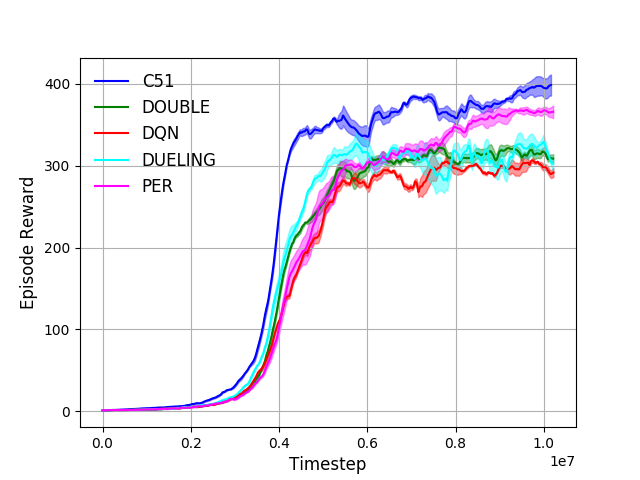

# Description
Comparison of DQN and its variants.

# Usage
1. Specify hyper-parameters in `config.py`.
2. Run `./run.sh $device $algorithm` for training with three random seeds.
3. Visualize the results by `python plot.py *log*`.

# Result on Breakdown
 